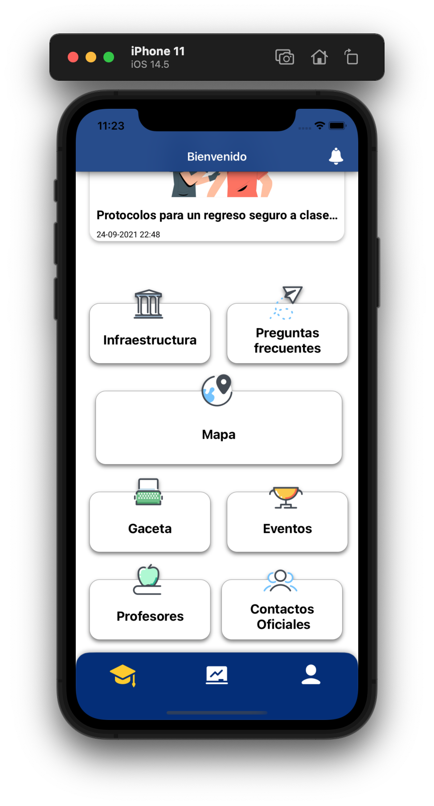

  

# PocketFI

* Garrido Sánchez Samuel Arturo
* Maceda Patricio Fernando

Muchos estudiantes cada año ingresan a la Universidad, siendo esta una de las mejores etapas de su vida.

Como primerizos nos encontramos muchas veces perdidos los primeros o últimos semestres por lo que a veces necesitamos algo de ayuda para ubicarnos o sacarnos de apuros por olvidar imprimir la práctica

Es por ello que nace el Proyecto Pocket FI

- Swift 5.3
- Patrón MVC
- Firebase (Firestore, Cloud Messaging)
- Apple Push Notifications
- Apple Wallet Kit
- Lottie
- Fuentes Externas: Roboto y Lato (se agregan al Info.plist)
- Escaneo de QR
- PDFKit
- MapKit + Annotations
- CoreData (Almacenamiento de Tareas)
- FileManager (salvar PDF)
- ActivityViewController
- Algoritmo pseudo Markdown para poner formatos estilo
encerrarlo entre símbolos
- Mayoría de vistas programáticas
- Instruments – Leaks
- UserNotifications
- DarkMode (paleta de colores para cada modo)
- Publicación en la App Store Connect y TestFlight:
 [Invitación a TestFlight](https://testflight.apple.com/join/jqqaeEjT)
 
### Features

Lee las noticias que más son relevantes para ti sobre la facultad.

- Ten a la mano un mapa práctico por si te pierdes
- Recibe notificaciones de tareas, horarios y calendarios de la
universidad.
- Ten a la mano tus series de ejercicios, manuales de prácticas de laboratorio y exámenes anteriores sin conexión y puedes exportar a otras aplicaciones o mandarlo por mensajería
- Horario a la mano
- Credencial estudiantil en Wallet para que se active cuando estés en la facultad. En un toque estarás adquiriendo un libro o una bici.
- Los sistemas de atención de la facultad, como el SIAE.
- Un registro de tus tareas.

### Capturas de pantalla

#### Pantallas principales

 
  

#### Banners de noticias
 
  

#### Credencial estudiantil en Wallet

#### Mapa de Guía

#### Material para el estudiante: Series, manuales de prácticas, horario y tareas.
 
 
 
 
 
 
 
  

### Modo oscuro

### Uso de instruments

No se registraron fugas de memoria en una ejecución completa de PocketFI

### Publicación en Testflight

